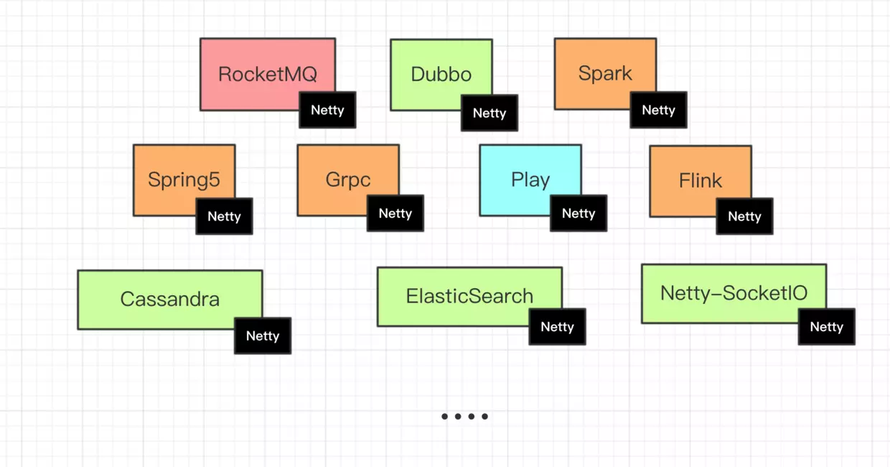

## 前言:
**Learning IO, learning netty !**

> **尚未完成，持续更新中...!**

备注: :⚒:表示**施工中,尚未完成**;   :✍️ :表示**已完成,但是没有写博文**; :✌️: 表示**已完成,并有相应的博文**;

========================

**什么是Netty?能做什么?**

- [Netty](https://netty.io/)是一个致力于创建高性能网络应用程序的成熟的IO框架

- 相比较与直接使用底层的Java IO API, 你不需要先成为网络专家就可以基于Netty去构建复杂的网络
  应用

- 业界常见的涉及到网络通信的相关中间件大部分基于Netty实现网络层,如下图所示:

### 『 基础 - 入门 』

- ⚒ ：常见IO模型

- ⚒ ：

- ⚒ ：

- ⚒ ：