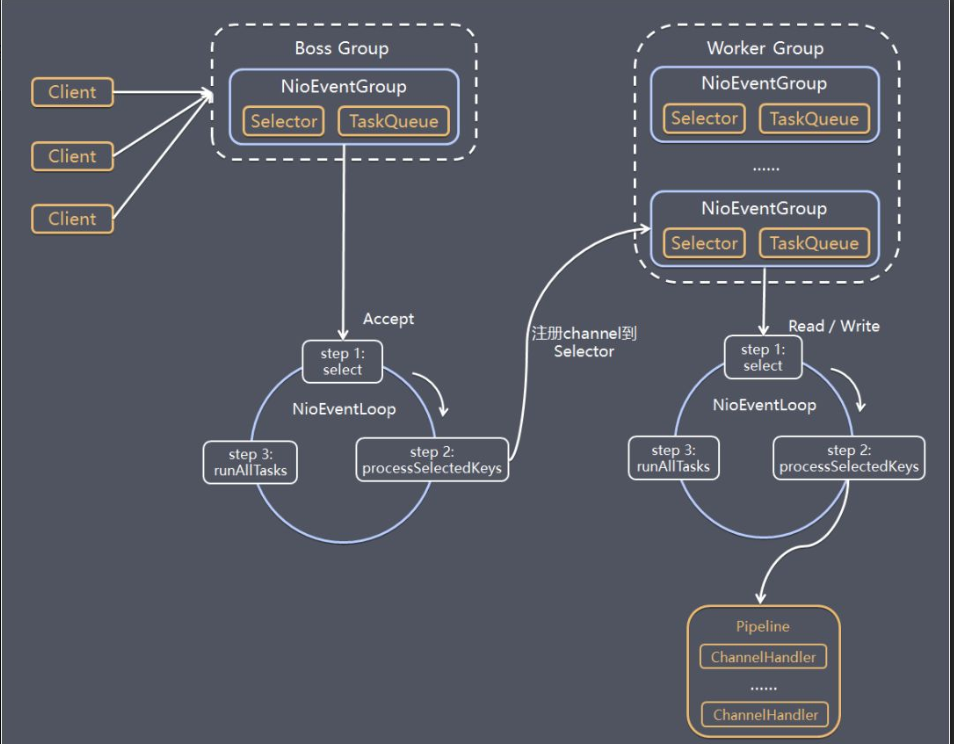

## Netty 的特点
- **高并发**：Netty 是一款基于 NIO（非阻塞IO）开发的网络通信框架，对比于 BIO（阻塞IO），并发性能得到了很大提高
- **传输快**：Netty 的传输依赖于零拷贝特性，尽量减少不必要的内存拷贝，实现了更高效率的传输
- **封装好**：Netty 封装了 NIO 操作的很多细节，提供了易于使用调用接口

## Netty 高性能表现在哪些方面？

1. **IO 线程模型**：同步非阻塞，用最少的资源做更多的事
2. **内存池设计**：申请的内存可以重用，主要指直接内存。内部实现是用一颗二叉查找树管理内存分配情况
3. **串形化处理读写**：避免使用锁带来的性能开销
4. **高性能序列化协议**：支持 protobuf 等高性能序列化协议
5. **内存零拷贝**：尽量减少不必要的内存拷贝，实现了更高效率的传输。zero-copy

### Netty 的零拷贝
> 传统的zero-copy是IO传输过程中，数据无需中内核态到用户态、用户态到内核态的数据拷贝，减少拷贝次数, Netty的zero-copy则是完全在用户态，或者说传输层的zero-copy机制

主要包含三个方面：
- Netty 的接收和发送 ByteBuffer 采用 DIRECT BUFFER，使用堆外直接内存进行 Socket 读写，不需要进行字节缓冲区的二次拷贝。如果使用传统的堆内存（HEAP BUFFERS）进行 Socket 读写，JVM 会将堆内存 Buffer 拷贝一份到直接内存中，然后才写入 Socket 中。相比于堆外直接内存，消息在发送过程中多了一次缓冲区的内存拷贝。

- Netty 提供了组合 Buffer 对象，可以聚合多个 ByteBuffer 对象，用户可以像操作一个 Buffer 那样方便的对组合 Buffer 进行操作，避免了传统通过内存拷贝的方式将几个小 Buffer 合并成一个大的 Buffer。

- Netty 的文件传输采用了 transferTo 方法，它可以直接将文件缓冲区的数据发送到目标 Channel，避免了传统通过循环 write 方式导致的内存拷贝问题

## Netty的线程模型
Netty通过Reactor模型基于多路复用器接收并处理用户请求，内部实现了两个线程池，boss线程池和work线程池，其中boss线程池的线程负责处理请求的accept事件，当接收到accept事件的请求时，把对应的socket封装到一个NioSocketChannel中，并交给work线程池，其中work线程池负责请求的read和write事件，由对应的Handler处理。

- 单线程模型：所有I/O操作都由一个线程完成，即多路复用、事件分发和处理都是在一个Reactor线程上完成的。既要接收客户端的连接请求,向服务端发起连接，又要发送/读取请求或应答/响应消息。一个NIO 线程同时处理成百上千的链路，性能上无法支撑，速度慢，若线程进入死循环，整个程序不可用，对于高负载、大并发的应用场景不合适。

- 多线程模型：有一个NIO 线程（Acceptor） 只负责监听服务端，接收客户端的TCP 连接请求；NIO 线程池负责网络IO 的操作，即消息的读取、解码、编码和发送；1 个NIO 线程可以同时处理N 条链路，但是1 个链路只对应1 个NIO 线程，这是为了防止发生并发操作问题。但在并发百万客户端连接或需要安全认证时，一个Acceptor 线程可能会存在性能不足问题。

- 主从多线程模型：Acceptor 线程用于绑定监听端口，接收客户端连接，将SocketChannel 从主线程池的Reactor 线程的多路复用器上移除，重新注册到Sub 线程池的线程上，用于处理I/O 的读写等操作，从而保证mainReactor只负责接入认证、握手等操作

## Netty 和 Tomcat 的区别

- 作用不同：Tomcat 是 Servlet 容器，可以视为 Web 服务器，而 Netty 是异步事件驱动的网络应用程序框架和工具用于简化网络编程，例如TCP和UDP套接字服务器。

- 协议不同：Tomcat 是基于 http 协议的 Web 服务器，而 Netty 能通过编程自定义各种协议，因为 Netty 本身自己能编码/解码字节流，所有 Netty 可以实现，HTTP 服务器、FTP 服务器、UDP 服务器、RPC 服务器、WebSocket 服务器、Redis 的 Proxy 服务器、MySQL 的 Proxy 服务器等等

## Netty 工作架构

server端包含1个Boss NioEventLoopGroup和1个Worker NioEventLoopGroup，NioEventLoopGroup相当于1个事件循环组，这个组里包含多个事件循环NioEventLoop，每个NioEventLoop包含1个selector和1个事件循环线程

每个Boss NioEventLoop循环执行的任务包含3步：
1. 轮询accept事件
2. 处理accept I/O事件，与Client建立连接，生成NioSocketChannel，并将NioSocketChannel注册到某个Worker NioEventLoop的Selector上 
3. 处理任务队列中的任务，runAllTasks。任务队列中的任务包括用户调用eventloop.execute或schedule执行的任务，或者其它线程提交到该eventloop的任务。

每个Worker NioEventLoop循环执行的任务包含3步：
1. 轮询read、write事件；
2. 处I/O事件，即read、write事件，在NioSocketChannel可读、可写事件发生时进行处理
3. 处理任务队列中的任务，runAllTasks