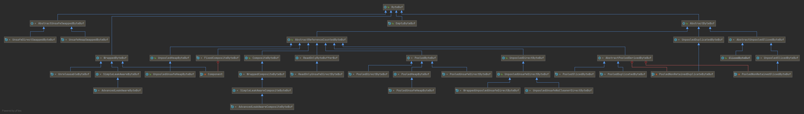
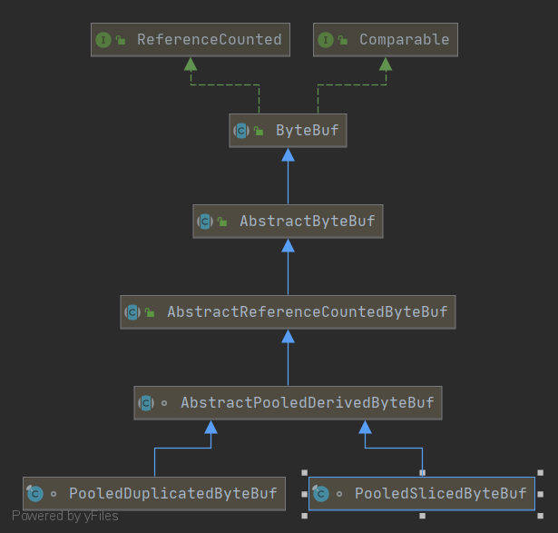

## Netty ByteBuf 
> 参考链接: https://skyao.gitbooks.io/learning-netty/content/buffer/inheritance.html
### ByteBuf 模块

#### ByteBuf基础实现类
按照是否支持池共享分为( `PooledByteBuf`是4.x之后的新特性, netty3.*和之前版本并不支持):
- `PooledByteBuf`
- `UnpooledByteBuf`

区别在于使用 UnPooled Buffer 时每次都会分配一个新的缓冲区, 而当使用 Pooled buffer 时，Netty 会尝试将缓冲区池化，从而最小化分配和释放缓冲区的开销

按照内存分配方式可分为:
- `HeapByteBuf`：直接使用堆内存
- `DirectByteBuf`: 使用 Java NIO 提供的直接内存，体现为使用 nio ByteBuffer
- `UnsafeDirectByteBuf`:  DirectByteBuf的特殊情况,如果当前系统提供了sun.misc.Unsafe

#### ByteBuf衍生类
DerivedByteBuf是在ByteBuf的基本实现基础上衍生出来的: 包装其他ByteBuf,然后增加一些特别的功能, 基类为抽象类 `AbstractDerivedByteBuf`

- `PooledDuplicatedByteBuf`: 简单的将所有的请求都委托给包装的ByteBuf
- `PooledSlicedByteBuf`: 将原有ByteBuf的部分内容拆分出来的ByteBuf,主要是为了实现zero-copy特性

##### CompositeByteBuf/FixedCompositeByteBuf
- `CompositeByteBuf` 是一个虚拟的buffer,将多个buffer展现为一个简单合并的buffer,以便实现netty最重要的特性之一: zero copy
- `FixedCompositeByteBuf` 功能类似`CompositeByteBuf`, 以只读的方式包装一个ByteBuf数组,通常用于写入一组ByteBuf的内容

#### 特殊的ByteBuf类
- `EmptyByteBuf`: 空的 ByteBuf, capacity 和 maximum capacity 都被设置为0.
- `SwappedByteBuf`: Swap/交换指的是`LITTLE_ENDIAN/BIG_ENDIAN`之间的交换, `SwappedByteBuf`用于包装一个ByteBuf,内容相同但是`ByteOrder`相反.它的子类`UnsafeDirectSwappedByteBuf`支持`memoryAddress`.
- `WrappedByteBuf`: `WrappedByteBuf`顾名思义是用来包装其他`ByteBuf`的,代码实现也简单: 包装一个`ByteBuf`,然后所有方法调用委托给被包装的`ByteBuf`

### ByteBuf 原理
