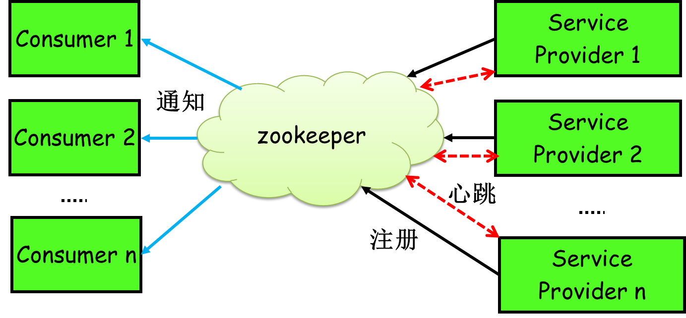

# Netty-Rpc

## Rpc 基本原理
### 如何透明化调用远程服务
> 使用 Java 代理封装通信细节, 让用户像本地调用方式调用远程服务

```java
public class RPCProxyClient implements java.lang.reflect.InvocationHandler{
    private Object obj;

    public RPCProxyClient(Object obj){
        this.obj=obj;
    }

    /**
     * 得到被代理对象;
     */
    public static Object getProxy(Object obj){
        return java.lang.reflect.Proxy.newProxyInstance(obj.getClass().getClassLoader(),
                obj.getClass().getInterfaces(), new RPCProxyClient(obj));
    }

    /**
     * 调用此方法执行
     */
    public Object invoke(Object proxy, Method method, Object[] args) throws Throwable {
        //结果参数;
        Object result = new Object();
        // ...执行通信相关逻辑
        // ...
        return result;
    }
}
```

### 怎么编解码消息
#### 确定消息数据结构
**客户端请求消息结构**
- 接口名称
- 方法名
- 参数类型 & 参数值 (Java 存在方法重载)
- 超时时间
- requestId

**服务端返回的消息结构**
- 返回值
-状态 code
- requestId

**为什么要有 requestId?**
因为远程调用通常来说是异步的，当有多个线程同时调用，这时server 和 client 之间建立的连接上会存在很多消息传递，而且网络情况不可控，消息传递顺序也是随机的，因此我们需要 requestId 机制来保证消息的准确传递

#### 序列化
确定了消息数据结构后，我们就需要序列化机制来完成消息以二进制形式的网络传输了，通常要考虑 3 点：
- 通用性，比如是否能支持Map等复杂的数据结构
- 性能，包括时间复杂度和空间复杂度，由于RPC框架将会被公司几乎所有服务使用，如果序列化上能节约一点时间，对整个公司的收益都将非常可观，同理如果序列化上能节约一点内存，网络带宽也能省下不少
- 可扩展性，对互联网公司而言，业务变化飞快，如果序列化协议具有良好的可扩展性，支持自动增加新的业务字段，而不影响老的服务，这将大大提供系统的灵活度

### 如何发布自己的服务
通过 zookeeper 实现注册中心，让多个服务提供者在 zk 上将自己的服务注册到zookeeper的某一路径上: `/{service}/{version}/{ip:port}`，服务消费者通过 zk 获取具体的服务访问地址 （ip + port）去访问具体的服务提供者


## Rpc 实现架构
### 基本架构

#### 调用关系
1. 服务容器负责启动，加载，运行服务提供者。
2. 服务提供者在启动时，向注册中心注册自己提供的服务。
3. 服务消费者在启动时，向注册中心订阅自己所需的服务。
4. 注册中心返回服务提供者地址列表给消费者，如果有变更，注册中心将基于长连接推送变更数据给消费者。
5. 服务消费者，从提供者地址列表中，基于软负载均衡算法，选一台提供者进行调用，如果调用失败，再选另一台调用。
6. 服务消费者和提供者，在内存中累计调用次数和调用时间，定时每分钟发送一次统计数据到监控中心

### 功能点
- 服务发现
- 序列化机制
- 自定义协议 & 协议编解码
- 健康检测，超时控制&心跳机制
- 路由策略 & 负载均衡


## 参考链接
- [Dubbo](https://dubbo.apache.org/zh/docs/)
- [蚂蚁自研 Rpc 框架 SOFARPC](https://www.sofastack.tech/projects/sofa-rpc/structure-intro/)
- [轻量级分布式 RPC 框架](https://my.oschina.net/huangyong/blog/361751)
- [NettyRpc](https://github.com/luxiaoxun/NettyRpc)
